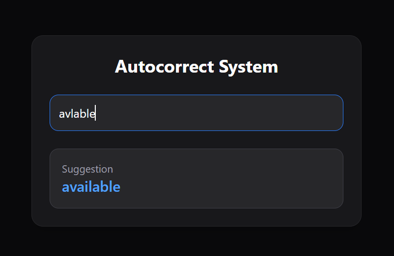

# Autocorrect-API
A simple autocorrect system built with FastAPI using word frequency data, Jaccard similarity, and Levenshtein distance.

## Status

This project is still under development and continuously improving.  
Contributions and suggestions are welcome.  
Feedback is appreciated.